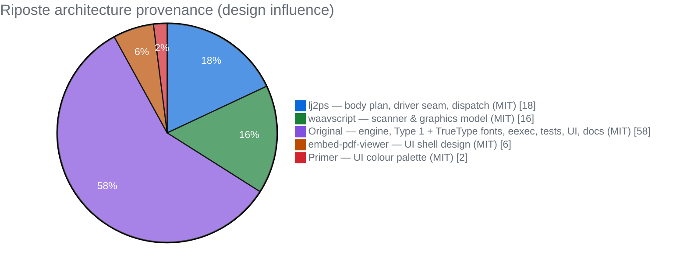

# Architecture

Riposte is a pure-JavaScript (ESM), zero-dependency PostScript reader. Its design
is a deliberate **transplant of the best ideas** from two MIT interpreter "code
donors" — [Wiladams/lj2ps](https://github.com/Wiladams/lj2ps) (Lua) and
[wiladams/waavscript](https://github.com/wiladams/waavscript) (C++) — with a
UI built on the [embed-pdf-viewer](https://github.com/embedpdf/embed-pdf-viewer)
design with the [GitHub Primer](https://primer.style) colour palette and
[Phosphor](https://github.com/phosphor-icons/core) icons (all MIT), and a
light/dark/system theme switch. It runs identically in Node, a Web Worker, and the browser.

> **All Riposte code is original and MIT-licensed.** The donors contributed
> *architecture and ideas*, not source — both donors are MIT, and the project is
> [single-license MIT](../README.md#credits). Architectures and APIs aren't
> copyrightable; clean-room reimplementation is.

## Code provenance

Riposte is a "Frankenstein" only in the kind sense — a transplant where each donor
contributes the one organ it does best, fused into one coherent engine. The chart
below is the **approximate design influence** per subsystem (not copied lines —
there are none):



- **lj2ps** is the body plan: it's the only GC'd-language donor, so its shapes map
  to JS almost unchanged — procedure-as-executable-array, operators-as-dictionary,
  the `bind` pre-pass, and (above all) the **Driver seam** that lets rendering swap
  backends with zero change to the operator layer.
- **waavscript** is the hands: the two-stage scanner and the graphics-context
  interface + CTM/path model.
- The **original** slice is the **no-host-recursion execution-stack evaluator**, the
  signature/type-pattern operator table, the windowed/aliasing object model, the
  **Type 1 + TrueType** font engines, **in-document `eexec`**, the worker/diff
  playground, the entire test suite, and these docs.
- The **UI** slice is the shell — grouped toolbar / tabbed **Pages + Outline** sidebar /
  page viewport / source-editor + output dock — reimplemented clean-room on the
  embed-pdf-viewer design, coloured with the **GitHub Primer** palette, with Phosphor
  icons and a light/dark/system theme switch.

The C/C++ memory management the donors relied on is deliberately **dropped**;
JavaScript provides real references and a garbage collector for free.

Slice colours are [GitHub Primer](https://primer.style) role colours — accent blue,
success green, done purple, severe orange, danger red — with a neutral Primer gray
title/legend, legible on both light and dark GitHub themes.

## Module map (`engine/`)

| Area | Modules |
|---|---|
| Object model | `object.js` — tagged `PSObject`; simple values inline; `PSString`/`PSArray` as `(backing, offset, length)` **windows** that alias on `getinterval`; `PSDict`; name interning; `MARK`/`NULL`/`TRUE`/`FALSE` singletons |
| Scanner | `scanner.js` — single-pass lexer + object builder; `{…}`→executable array at scan time, `[] << >>`→run-time tokens |
| VM | `vm.js` — operand / execution / dictionary / hold stacks; `execObject`/`execName` dispatch; the eval loop; `save`/`restore` — plus `save.js` (copy-on-write snapshots) |
| Frames | `frames.js` — execution-stack frames (`ProcFrame`/`FileFrame`/`ForFrame`/`RepeatFrame`/`LoopFrame`/`Forall*`/`StoppedFrame`) + `exit`/`stop` unwinding. `FileFrame` streams a program straight from a `Scanner` so `currentfile` can hand the input to `eexec` |
| Dict stack | `dictstack.js` — systemdict→userdict→… top-down resolution |
| Errors | `errors.js` — `PSError` (carries the PostScript error name) |
| Operators | `operators/{stack,math,relational,control,dict,composite,array,string,type,io,file,graphics,path,paint,ctm,vmem}.js` + `index.js` (registers all into systemdict) — `file.js` has `currentfile`/`eexec`/`closefile` for in-document fonts |
| Graphics | `graphics/{matrix,paint,path,gstate,font}.js`; `graphics/driver.js` + `canvas-driver.js` / `svg-driver.js`; `graphics/render.js` (`renderToSVG`) |
| Documents | `dsc.js` (DSC comment parser); `document.js` — the page-renderer API: `loadDocument` / `pageBBox` / `renderPageToDriver` / `renderPageToSVG` / `extractText` |
| Fonts | `font/bytes.js` (shared byte helpers); `font/type1-crypt.js` (cipher); `font/type1-charstring.js` (charstring → outline, incl. subrs / flex / seac); `font/type1.js` (parse `.pfb`/`.pfa` → descriptor, also used by in-document `eexec`); `font/truetype.js` (parse sfnt — `glyf`/`loca`/`cmap`/`hmtx`, composites, quadratic → cubic) — all wired into `findfont` (font registry) + `show` to fill embedded-glyph outlines |
| Embed | `embed/postscript-renderer.js` — host-viewer renderer adapter (`.doc-page` + canvas per page); `embed/register.js` — `EXT_MAP` / `RENDERER_LOADERS` glue |
| REPL | `repl.js` — `node engine/repl.js` |

## The execution model (why recursion can't overflow the host stack)

PostScript is a stack machine, and Riposte runs it **iteratively,
over an explicit execution stack of frames** — never by recursing the JavaScript
call stack.

- `vm.run()` repeatedly `tick()`s the top frame. A `ProcFrame` executes one element
  of an executable array per tick; executing a *name* that resolves to a procedure
  pushes a **new** `ProcFrame` (it does not call back into `run()`).
- So a recursive PostScript procedure builds depth on the **heap-backed execution
  stack**, not the host call stack. A 20,000-deep recursion through `ifelse` — which
  would blow a host-recursive evaluator around ~10k — runs fine (see the test suite).
- **Loops** (`for`/`repeat`/`loop`/`forall`) push a loop frame that re-injects its
  body each iteration. **`exit`/`stop`** unwind the execution stack to the nearest
  loop / `stopped` barrier — no exceptions. (An error behaves like `stop`, so it's
  catchable by an enclosing `stopped`.)

The dispatch rule is the textbook PostScript one (`execObject`): an executable
**name** is resolved and executed; an executable **operator** runs; everything else
— including an executable array read straight from the stream, and all literals —
is **pushed** onto the operand stack. A procedure executes only when a name resolves
to it, via `exec`, or via a control operator.

## Object model

One uniform tagged `PSObject { type, value, executable, access }`:

- **Simple values inline.** Integer/real/boolean carry the JS primitive directly;
  int vs real stay distinct (so `type`, `cvi`/`cvr`, `idiv`/`mod` are correct).
- **Composites are windows.** `PSString` (over a `Uint8Array`) and `PSArray` (over a
  JS array) hold `(backing, offset, length)`. `getinterval`/substring **alias** the
  same storage — required by PostScript semantics, not an optimization.
- **Names are interned** to integer ids, so name equality (and dict lookup) is an id
  compare.
- **Executable vs literal is a flag**, not a type — a procedure is just an executable
  array.

## Rendering: the Driver seam ✅

The single most important idea borrowed from all three donors is that the operator
layer contains **zero rendering logic** — it calls an abstract `Driver`. In the
donors that seam hid the native **blend2d** library; in Riposte it hides the
browser's Canvas 2D:

```
operators ─► Driver (interface) ─► CanvasDriver ─► CanvasRenderingContext2D   (browser)
                                 └► SVGDriver      (export / headless, exact vector)
                                 └► RasterDriver   (headless PNG, software scanline fill)
```

PostScript's imaging model maps 1:1 onto Canvas 2D (`moveto`→`moveTo`, `eofill`→
`fill('evenodd')`, CTM→`setTransform`, `gsave`→`save`), so no 2D library is needed —
the platform's canvas *is* the engine, and headless output goes through our own
`SVGDriver`. **`CanvasDriver` and `SVGDriver` are implemented today** (`RasterDriver`
is planned).

The playground drives this pipeline from a **Web Worker** when the browser supports
`OffscreenCanvas` — interpreting and rasterising off the main thread, then posting the
page back as an `ImageBitmap` (with a main-thread fallback otherwise).

---

See [TESTS.md](TESTS.md) for how each part is validated, and
[CONTRIBUTING.md](CONTRIBUTING.md) for the pure-JS / single-license-MIT ground rules.
